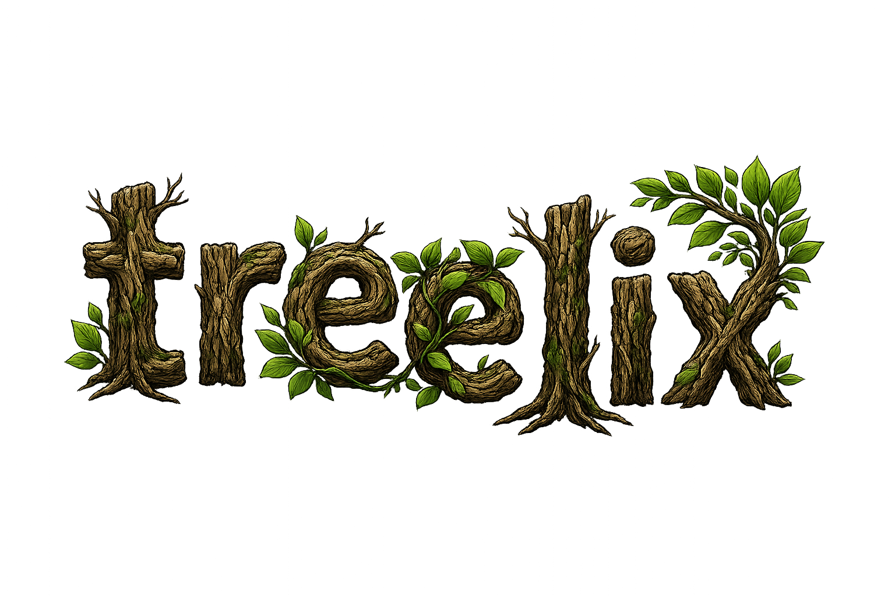

<p align="center">
  
</p>

An [nvim-tree](https://github.com/nvim-tree/nvim-tree.lua)-style terminal file
explorer for the [Helix](https://helix-editor.com) editor, written in Rust.

Helix has no plugin system and nothing like nvim-tree. treelix is a standalone
sidebar process — drop it in a [zellij](https://zellij.dev) (or tmux/wezterm)
pane next to Helix and it behaves like nvim-tree: a live file tree with git
status, file-watching auto-reload, file operations, and theme matching.
Selecting a file opens it in your already-running Helix instance.

It was built to replace [broot](https://dystroy.org/broot/) as the file sidebar.

## Features

- **Tree view** with Nerd Font icons, indent guides, dirs-first sorting, lazy
  loading, and a `~`-shortened root header.
- **Git status** (per-file glyphs + colors, propagated to folders) via the
  `git` CLI — staged `✓`, dirty `✗`, untracked `★`, renamed `➜`, deleted,
  conflict, ignored `◌`.
- **Auto-reload**: a debounced filesystem watcher refreshes the tree when files
  change on disk (mirrors nvim-tree's `filesystem_watchers`).
- **File operations**: create, rename, delete (with confirm), trash, cut/copy/
  paste, and copy-path-to-clipboard.
- **Open in Helix**: `<CR>` opens the file in the running Helix over its Unix
  socket (helix-editor/helix PR #13896), with vsplit/hsplit and system-open.
- **Reveal**: a tiny IPC socket lets Helix tell treelix to reveal the current
  buffer (`treelix reveal <path>`), replacing broot's `--listen`/`--send`.
- **Theming**: treelix owns its theme via its own theme file and ships a
  built-in Deep Nord Aurora theme. It can also derive colors from your active
  Helix theme (`theme = "helix"`).

## Install

Requires a Rust toolchain and a Nerd Font.

```sh
git clone https://github.com/kodyberry23/treelix ~/projects/treelix
cargo install --path ~/projects/treelix   # installs `treelix` into ~/.cargo/bin
```

## Usage

```sh
treelix [--root <dir>] [--theme <name>]   # run the sidebar TUI (root: cwd)
treelix reveal <path>                      # reveal a path in a running instance
```

Press `g?` inside treelix for the keybinding help panel.

### Keybindings (nvim-tree defaults)

| Key | Action |
|---|---|
| `j` / `k`, arrows | down / up |
| `K` / `J` | first / last sibling |
| `<CR>` / `o` | open file / toggle directory |
| `l` | expand directory |
| `h` / `<BS>` | collapse / go to parent |
| `P` | move cursor to parent |
| `<C-]>` | cd into directory (re-root) |
| `-` | re-root to parent |
| `E` / `W` | expand all / collapse all |
| `<Tab>` | preview in Helix (keeps focus in treelix) |
| `<C-v>` / `<C-x>` | open in vsplit / hsplit |
| `s` | system open |
| `a` | create (trailing `/` = directory) |
| `d` / `<Del>` | delete (confirm) |
| `D` | trash |
| `r` / `e` | rename / rename basename |
| `x` / `c` / `p` | cut / copy / paste |
| `y` / `Y` / `gy` | copy filename / relative path / absolute path |
| `.` / `I` | toggle hidden / git-ignored |
| `R` | refresh |
| `g?` | help |
| `q` | quit |

## Configuration

Optional `~/.config/treelix/config.toml`:

```toml
theme = "nord-aurora"   # a treelix theme name, or "helix" to derive from Helix
icons = true            # Nerd Font glyphs (false → ASCII fallbacks)
show_hidden = false
show_ignored = false
# open_command = "~/projects/helix-files/scripts/dispatch-to-editor.sh {mode} {path}"
```

### Themes

A treelix theme is a TOML file (`~/.config/treelix/themes/<name>.toml`) with a
`[palette]` of `name = "#hex"` and a `[styles]` table mapping treelix elements
(`text`, `directory`, `git_staged`, …) to `"fg"`, `"fg / bg"`, or
`"fg / bg / mods"` specs. See [`themes/nord-aurora.toml`](themes/nord-aurora.toml).

## Opening files in Helix

By default treelix routes `<CR>` to the dotfiles dispatcher
`~/projects/helix-files/scripts/dispatch-to-editor.sh` (which sends `:open`/
`:vsplit` to Helix over its per-session socket and focuses the editor pane,
falling back to spawning a fresh `hx` pane). If that script isn't present,
treelix performs the same dispatch itself, resolving the socket from
`HELIX_SOCKET_PATH` / `$XDG_RUNTIME_DIR/helix/<session>.sock`. Override with
`open_command` or the `TREELIX_DISPATCH_TO_EDITOR` env var.

## Roadmap

Built today (core): tree render, git status, auto-reload, file ops, open-in-
Helix, reveal IPC, theming, hidden/ignored filters.

**Phase 2 (full nvim-tree parity), not yet implemented:**

- Marks / bookmarks (`m`, `M`, `bd`, `bt`, `bmv`) with persistence
- Live filter (`f` / `F`) and search-node (`S`) via `nucleo`
- Sort modes (mtime / extension / filetype, files-first)
- Group empty directories (`L`)
- Git navigation (`[c` / `]c`) and git-clean filter (`C`)
- Window picker (`O`), new-tab (`<C-t>`)
- Visual-mode multi-select bulk operations
- File-info popup (`<C-k>`), run-command (`.`), custom filter (`U`)
- Symlink-destination display toggle, special-file highlighting

**Not feasible standalone** (depend on the editor's LSP / buffer state):

- Diagnostics column (`]e` / `[e`, severity icons) — needs Helix's LSP state.
- `no_buffer` filter (`B`) and modified indicator — need Helix's buffer list.

## License

MIT
